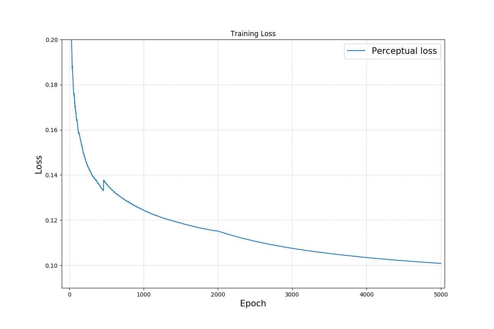
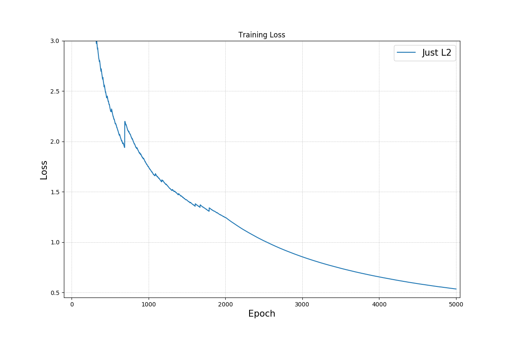

# Astro_U-net

 <b>  Astro-U-net:  Learning to Enhance Astronomical Images </b> 

 Experiments are fun! During training of our networks we work with different hyperparameters to find the best ones. In this section we provide the results from different networks which we trained. We evalueted our networks with the <a href="https://www.astromatic.net/software/sextractor">Source Extractor</a>. Evaluation was done on images in electrons. We created two types of table, first one refers to cross-match SExtractor files for Ground Truth x Output and the second one refers to Ground Truth x Output x Input. PSNR, SSIM, KL are same for both tables and the SNR is calculated just for Ground Truth x Output x Input. 

  

  
  Source Extractor  

  
  |Network | RFE [%]| RFE error [%] | 	TPR [%] |	F-measure| SNR | PSNR | SSIM | KL|
  | --- | --- | --- | --- | --- | --- | --- | --- | --- | 
  | Just L1 | 2.43 | 0.18 | 95.7 | 0.84 | 1.64 | 13.4 | 0.63 |0.0074 | 
  | Just L2 | 4.87| 0.18 | 94.5 | 0.89 | 1.58 | 4.6 | 0.60 | 0.0130 |
  |L1 + perceptual loss  | 2.39 | 0.18 | 96.0 | 0.84| 1.64 | 11.6 | 0.64 | 0.0069 |
  |L1 + KL divergence loss  | 2.18 | 0.18 | 95.9 | 0.85 | 1.63 |14.0 | 0.64 | 0.0068 |
  |Filters  | 2.66 | 0.18 | 96.3 | 0.87 | 1.62 | 11.6 | 0.64 | 0.0070 | 
  |Segmentation map | 8.52 | 0.16 | 95.0 | 0.91 | 1.58| 12.4 | 0.61 |0.0085|
  |Input multiplied by ETR, L1 loss | 2.39| 0.18 |96.0 | 0.84 | 1.62 | 12.7 | 0.64 | 0.0075 |
  | Multiple ETR (random order) | 2.58 | 0.18 | 95.9 | 0.85 | 1.62 | 13.5 | 0.64 | 0.0071|
  | ReLU activation | 2.51 | 0.18 | 96.0 | 0.85 | 1.64 | 13.3 | 0.63 | 0.0072 |
  | PReLU activation | 2.60 |0.18 | 95.9 | 0.84 | 1.63 | 13.7 | 0.63| 0.0070|
  | Swish activation | 2.20 | 0.18 | 95.7 | 0.86 | 1.61 | 11.6 | 0.65 | 0.0073|
  | Input Image - for comparison | 1.55 | 0.21 | 68.08 | 0.78 | 0 | -16 | 0.45 | 0.0231 |
  
   Cross-match of Ground Truth x Output.  Relative flux error is denote as RFE, True Positive as TP and True Positive Rate as TPR.
    
  
  |Network | RFE [%]| RFE error [%] |
  | --- | --- | --- |
  | Just L1 | 1.54 | 0.14 |
  | Just L2 | 3.73| 0.14 |
  |L1 + perceptual loss  | 1.66 | 0.14 |
  |L1 + KL divergence loss  | 1.46 | 0.14 | 
  |Filters  | 1.66 | 0.14 | 
  |Segmentation map | 4.72 | 0.13 |
  |Input multiplied by ETR, L1 loss | 1.61| 0.14 |
  | Multiple ETR (random order) | 1.69 | 0.14 |
  | ReLU activation | 1.65 | 0.14 | 
  | PReLU activation | 1.81 |0.14 | 
  | Swish activation | 1.46 | 0.14 | 
  | Input Image - for comparison | 1.55 | 0.21 |
  
 Cross-match of Ground Truth x Output x Input. Relative flux error is denote as RFE. True Positive is ~ 3350 True Positive Rate ~ 67% for all networks.
 
 
 <b>  Loss Plots </b>  
 
  
  

  
  

  
  

  
 
