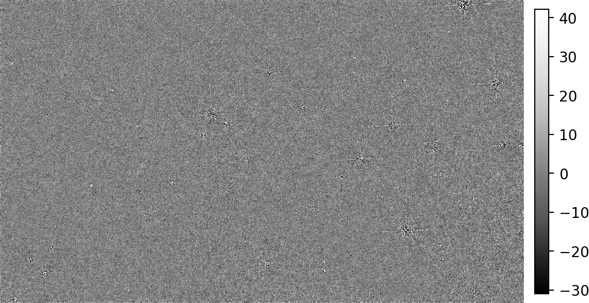
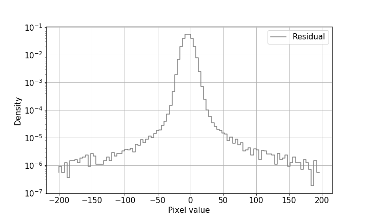
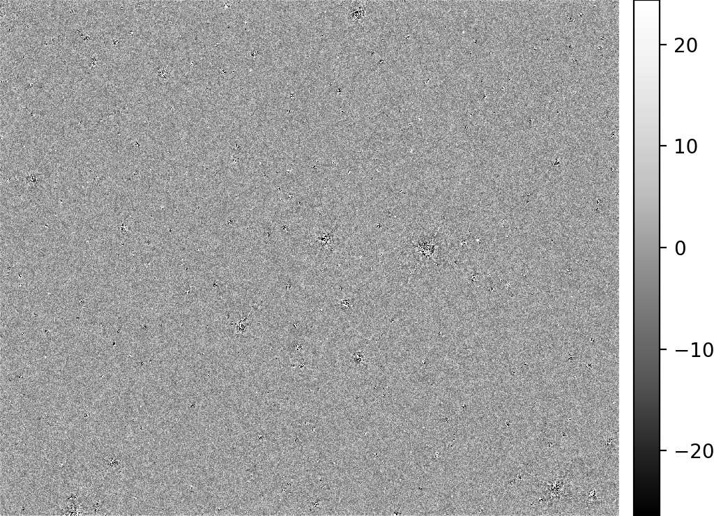
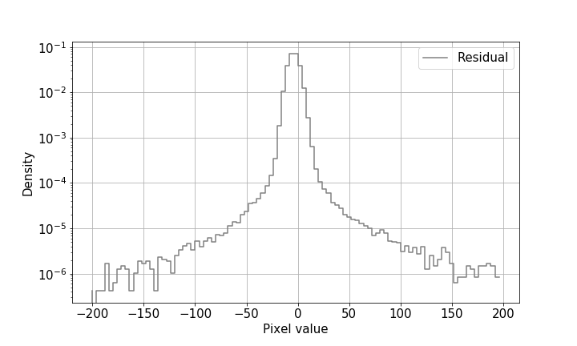

 
 <b>  Astro-U-net:  Network 1 </b> 

 
 
  The input and output have one channel with size 256x256. Information about the exposure time ratio, is added at the bottom of the U-net. For training we use an exposure time ratio of two. The network is trained for 5000 epochs and it take ~ 48 hours. Each epoch has 160 iterations, where it sees a random crop from each of the 160 training images. Evaluation was done on images in electrons. We created two types of table, first one refers to cross-match SExtractor files for Ground Truth x Output and the second one refers to Ground Truth x Output x Input. PSNR, SSIM, KL are same for both tables and the SNR is calculated just for Ground Truth x Output x Input. 

 
 
  
 
 |Image| RFE [%] | RFE error [%] | TP |TPR [%] |F-measure| SNR | PSNR | SSIM | KL|
 | --- | --- | --- | --- | --- | --- | --- | --- | --- | --- | 
 |Network Output | 2.26|0.18| 4334 | 98.94 | 0.86 | 1.63 | 13.6 | 0.64 | 0.007 |
 |Input | 1.55| 0.21 | 3366 | 68.08 | 0.78 | 0 | -16 | 0.45 | 0.0231 |
  
  Cross-match of Ground Truth x Output.  Relative flux error is denote as RFE, True Positive as TP and True Positive Rate as TPR.

  
 |Image|Ratio | RFE [%] | RFE error [%] | TP | TPR [%] | SNR | 
 | --- | --- | --- | --- | --- | --- | --- |
 |Network Output | 2 | 1.67 |0.14| 3347 | 67.43 | 1.63 |
 |Input | 2 | 1.55 | 0.21 | 3347 | 67.43 |  0 | 
 
 
 
 Cross-match of Ground Truth x Output x Input. Relative flux error is denote as RFE, True Positive as TP and True Positive Rate as TPR.
   

 <b>  Histogram </b> 

	

 

 

 <b>  Residuals </b> 

    

    

