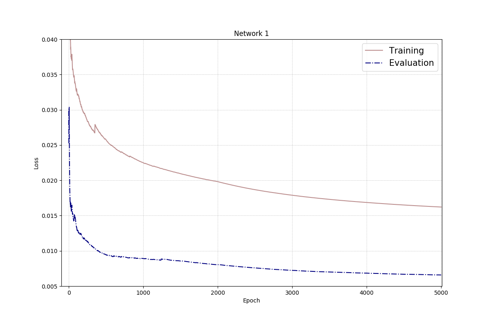
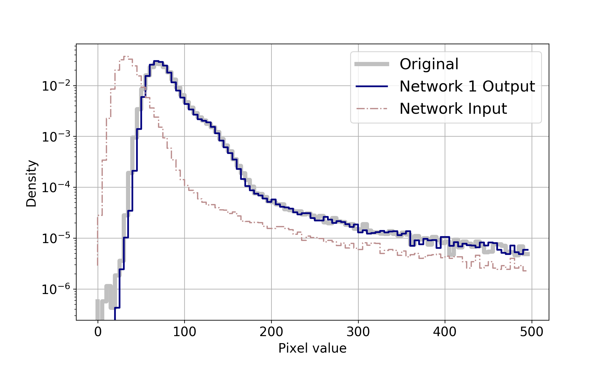
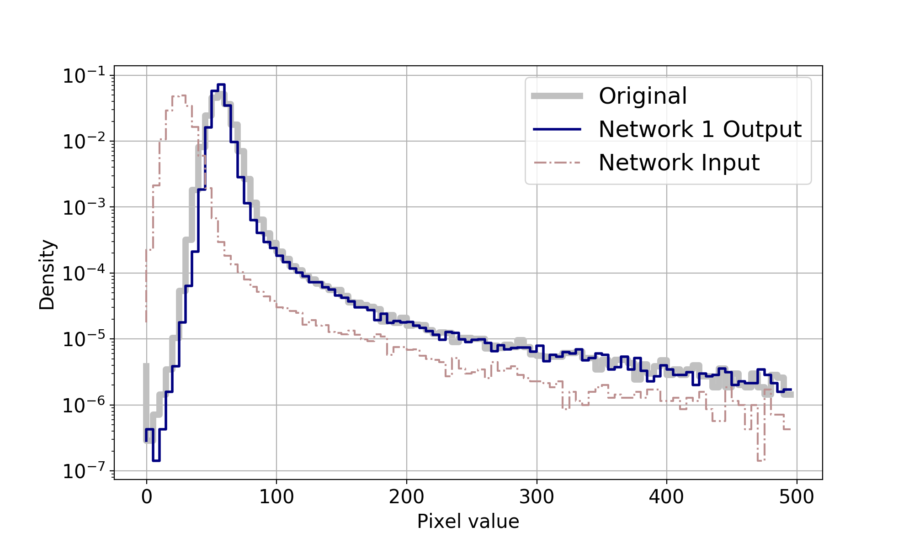
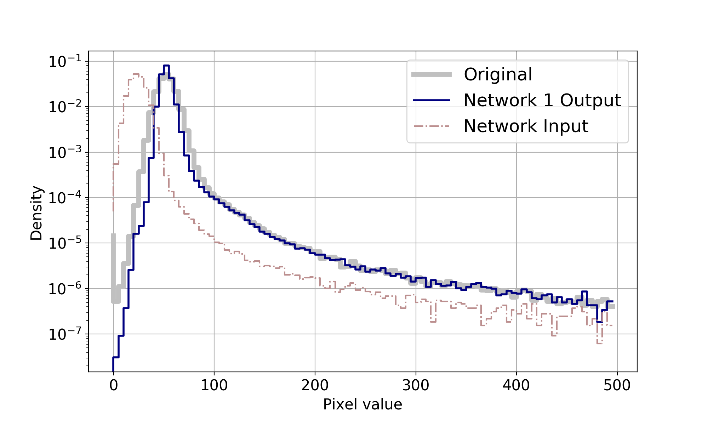

 
 <b>  Astro-U-net:  Network 1 </b> 

 
 
  The input and output have one channel with size 256x256. Information about the exposure time ratio, is added at the bottom of the U-net. For training we use an exposure time ratio of two. The network is trained for 5000 epochs and it take ~ 48 hours. Each epoch has 160 iterations, where it sees a random crop from each of the 160 training images.  

 
 
 
 |Image| Flux error | True positive |	True positive rate |	F-measure| SNR | PSNR | SSIM | KL|
 | --- | --- | --- | --- | --- | --- | --- | --- | --- | 
 |Network Output | 2.26| 4334 | 98.94 | 0.86 | 1.63 | 13.6 | 0.64 | 0.007 |
 |Input | 49.79| 3366 | 68.08 | 0.78 | 0 | -16 | 0.45 | 0.0231 |

	

 

 

