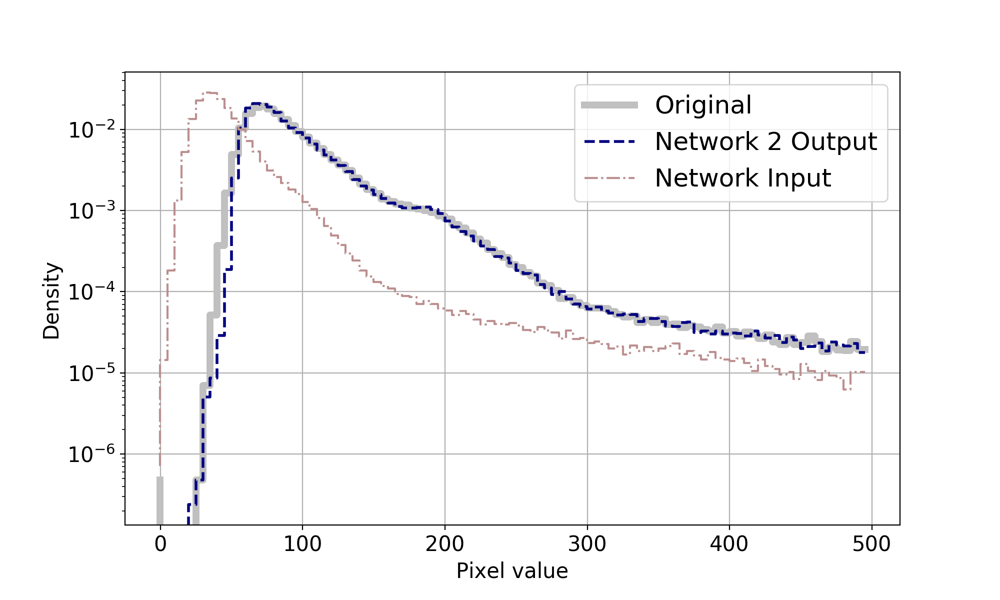
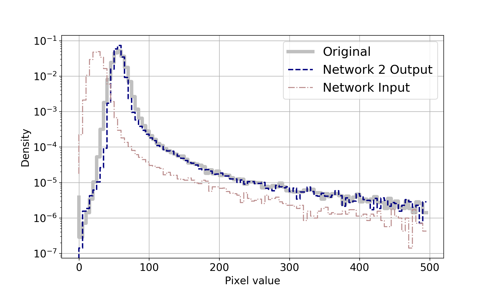
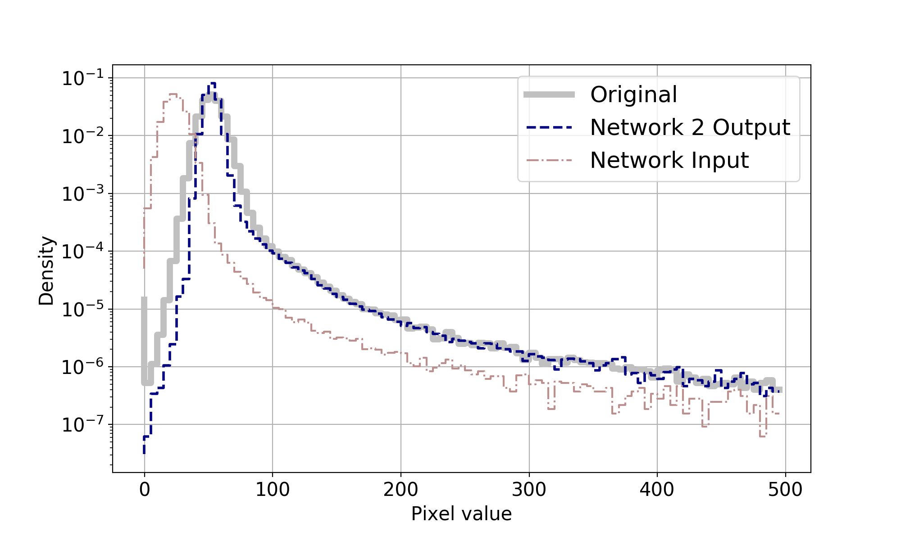
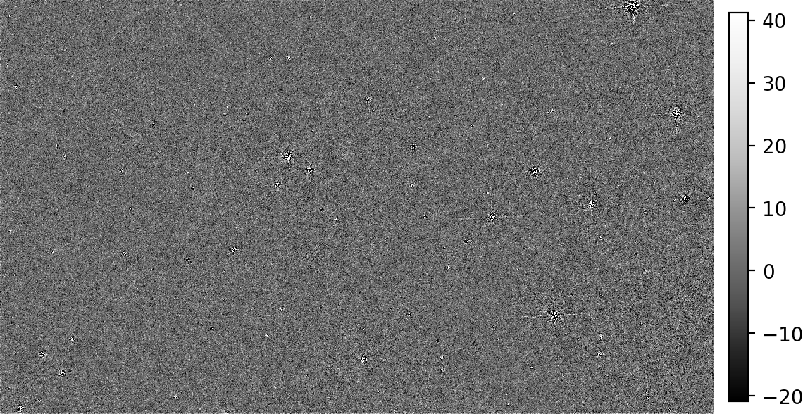
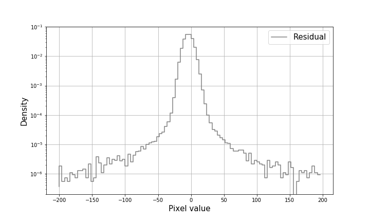
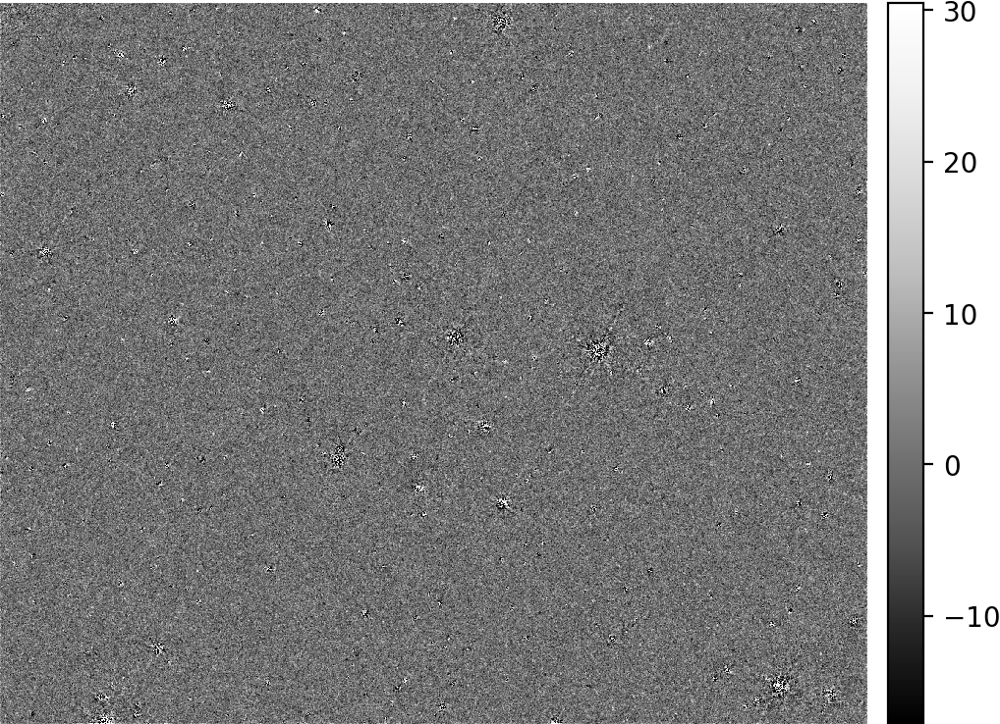
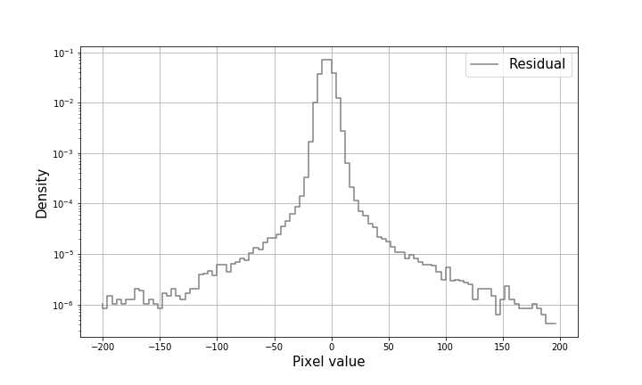

 
 <b>  Astro-U-net:  Network 2 </b> 

 
 
 In our second network, we trained on exposure time ratios between two and five. The ratio is selected in order -- for every image crop we trained network with all ratios (2,3,4,5). Network 2 is trained for 5000 epochs, with 150 iterations per epoch. In each  iteration the network sees the same random image crop, with all exposure time ratios in order. Training of the network takes approximately 62 hours. The histograms showed below are for ratio 2. Evaluation was done on images in electrons. We created two types of table, first one refers to cross-match SExtractor files for Ground Truth x Output and the second one refers to Ground Truth x Output x Input. Relative flux error is denote as RFE. PSNR, SSIM, KL are same for both tables and the SNR is calculated just for Ground Truth x Output x Input.

 
 
 
 |Image|Ratio | RFE [%] | RFE error [%] | True positive |True positive rate [%] |F-measure| SNR | PSNR | SSIM | KL|
 | --- | --- | --- | --- | --- | --- | --- | --- | --- | --- | --- | 
 |Input | 2 | 1.55 | 0.21 | 3366 | 68.08 | 0.78 | 0 | -16 | 0.45 | 0.0231 |
 |Network Output | 2 | 2.26 |0.18| 4341 | 96.30 | 0.85 | 1.64 | 13.3 | 0.63 | 0.0069 |
 
 
 
 
 
 |Image|Ratio | RFE [%] | RFE error [%] | True positive | True positive rate [%] | SNR | 
 | --- | --- | --- | --- | --- | --- | --- |
 |Input | 2 | 1.55 | 0.21 | 3349 | 67.66 |  0 | 
 |Network Output | 2 | 1.54 |0.14| 3349 | 67.66 | 1.64 |
 

 <b>  Histogram </b> 

	

 

 

 <b>  Residuals </b> 

    

    

