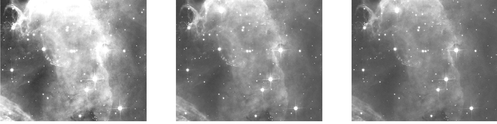

# Astro_U-net

 <b>  Astro-U-net:  Learning to Enhance Astronomical Images </b> 

 Astronomical images are essential for exploring and understanding the universe. Images often contains additive noise, which makes denoising mandatory step in post-processing data before further data analysis.  In order to maximise the efficiency and information gain in the post-processing of astronomical imaging, we decided to turn on machine learning. We propose Astro U-net, a fully-convolution neural network for image denoising and enhancement. We made many experiments and picked two of them -- Network 1 and Network 2. More details are provided in the <a href='https://arxiv.org/abs/2011.07002'>paper</a>. 

To watch ESAC TechTalk click <a href='https://www.youtube.com/watch?v=QpjQ6Lu0GZ4&feature=youtu.be'>here</a> :).

